# GTA Roleplaying Script

This project is a roleplaying game mode for GTA-MP multiplayer modification for GTA V. It contains features such as player ownable houses, housing market, vehicle system, weather system, chat system, fishing system and much much more.

## NOTE
The classes are fairly well documented so if you wonder how something is implemented, you should take a look at the code. If you find any bugs, please describe it and open an issue or pull request with your fix.

#### Also note: I am in China for few months so the larger updates will resume at the beginning of February. The game mode has also not been tested with the beta branch of GTA-MP, so I suggest you to use the stable branch meanwhile.

####

```diff
-If you get sql errors, make sure you have used the latest gta_rp.sql file
```

```diff
-If you are trying to run the server on OS X or Linux by using Mono, remember to use the correct DLL files. The System.Data.Dll needs to be specific to the platform, for example on OS X you will find the right one in the mono install folder. If you try to use windows DLL on OS X or Linux, you will get large errors and message that the DLL can't be read on mono. 
```

## Current features
- Account system in a way that one account can have multiple characters
- House ownership system
- Vehicle ownership and parking system
- Vehicle shop system with easy way to create new shops
- Dynamic weather system
- Fishing system
- Jobs system with the possibility of making new professions easily
- Faction system for factions like police and military, new factions can be easily added
- Phone system with address book and the possibility of sending text messages and making phone calls
- Fully working inventory system and shop system where player can buy and sell items
- System the randomizes new houses to the housing market for sale
- Good chat system with toggles for OOC, support for roleplaying commands like /it, /me etc
- Prison system
- Taxi system

## Upcoming things
- More jobs
- Ability to put houses for rent
- Insurance for vehicles, handling vehicle destruction
- Websockets for interacting with a website where the new housing market and user panel will be placed at
- Fully functioning police system

## Controls
- F1: Open player menu

## Requirements

- GTA-MP Server
- MySql

## Installation

1. Put all the content inside a folder called GTA-RP and place it in the resources folder of your GTA-MP Server installation

2. Set GTA-RP as the current game mode inside the **settings.xml** which should be found inside the GTA-MP Server root

3. Create a file called **Config.ini** inside the Config folder (if the folder doesn't exist, create it at the game mode root) and add the following:

```
[database]
; database configuration
server="server here, usually localhost"
dbname="database name here"
username="username here"
password="password here"
```

4. Import the database file **gta_rp.sql** (Found at the root of this repository) provided here to initialize the database
	- It contains a test account with name **Test** and password **test123**
		- **Note:** Your GTA-MP name must match the account name currently. 
			- In the future, social club ID will be used instead.
	- It also contains a few characters on the account, their property ownerships and vehicle ownerships

5. Have **MySql.Data.dll**, **INIFileParser.dll** and **System.Data.dll** in the GTA-MP Server directory root (If you don't have them, move them from the dll folder). Note that these DLLs are for windows platform, if you run the server on OS X by using mono, you need to replace the System.Data.dll with the OS X mono specific one.

## Pictures of the game mode

### General pictures:
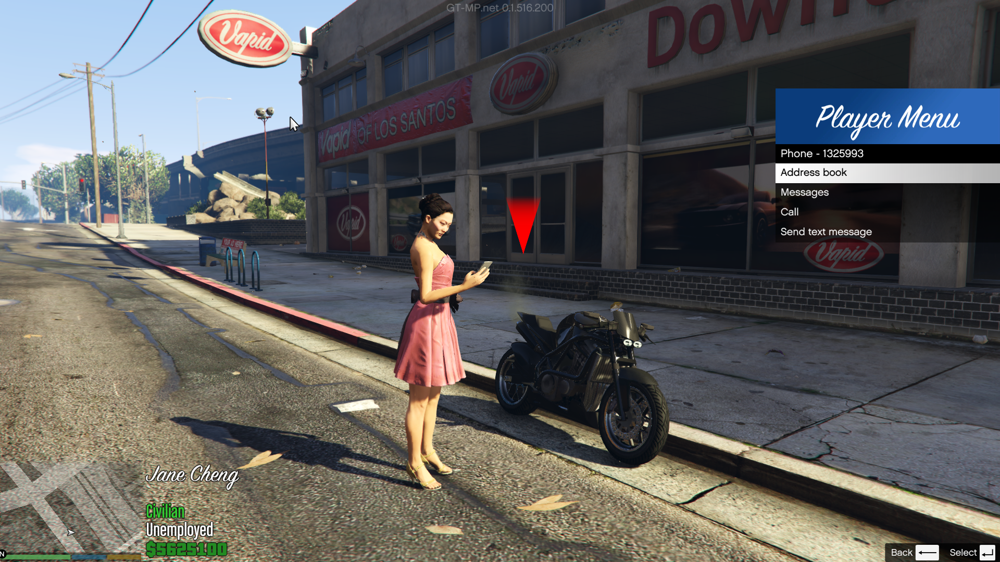
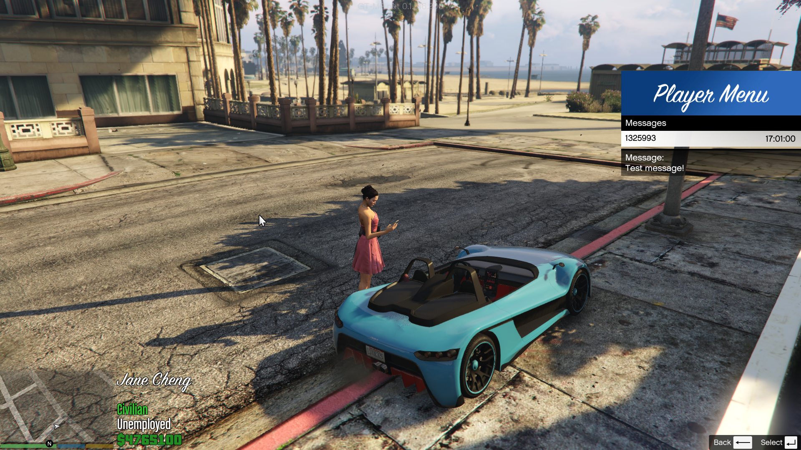
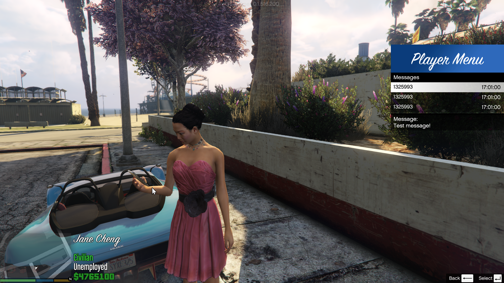

### Buying a vehicle:
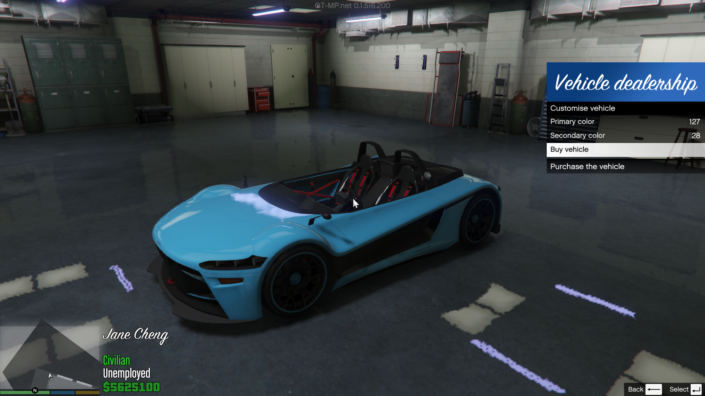

### Login screen:
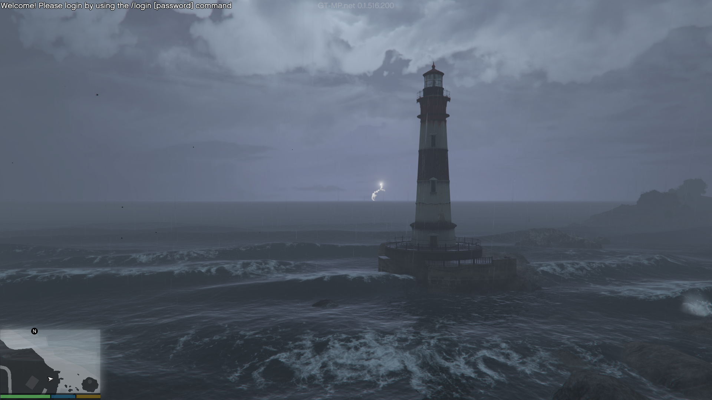
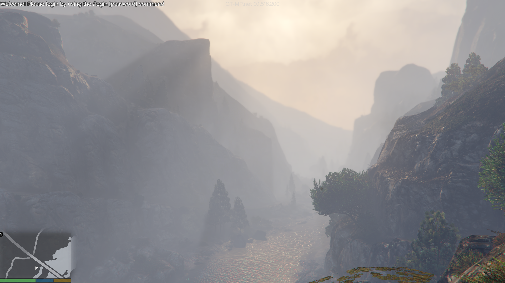

### Character selection:
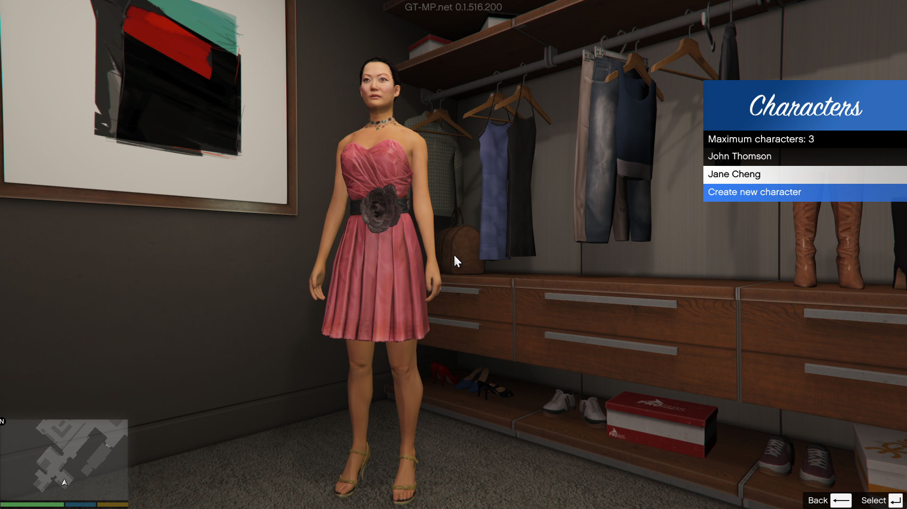

### Working as a garbage truck driver:
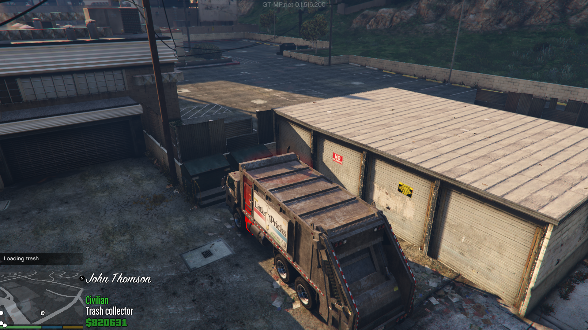
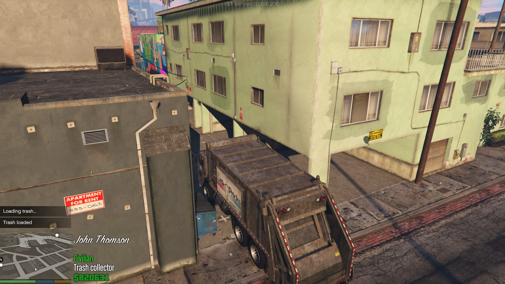

### Housing pictures:
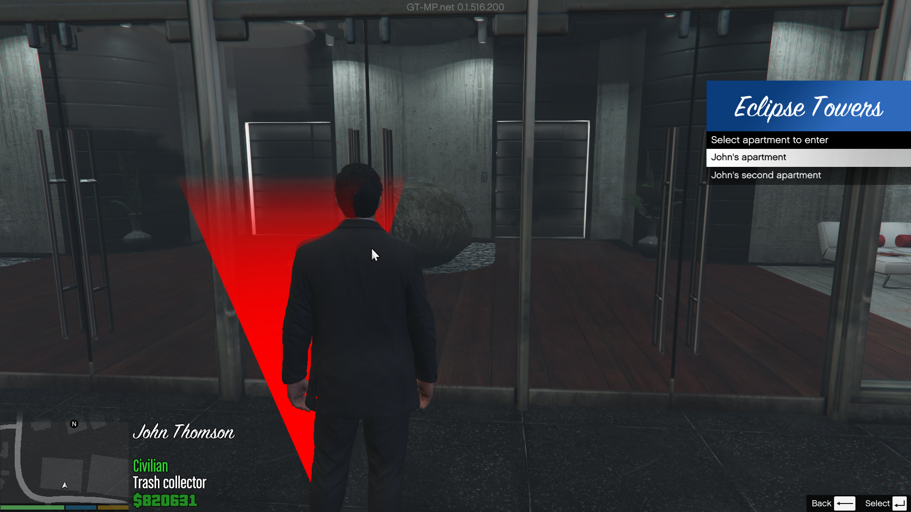
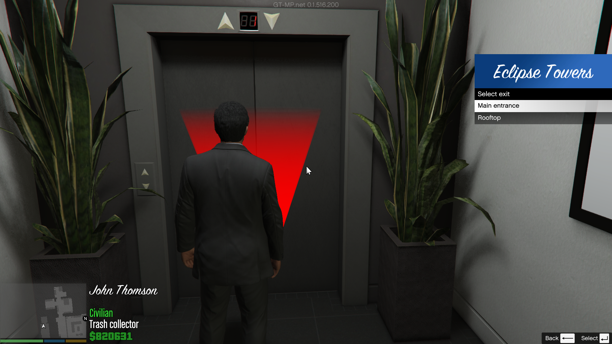
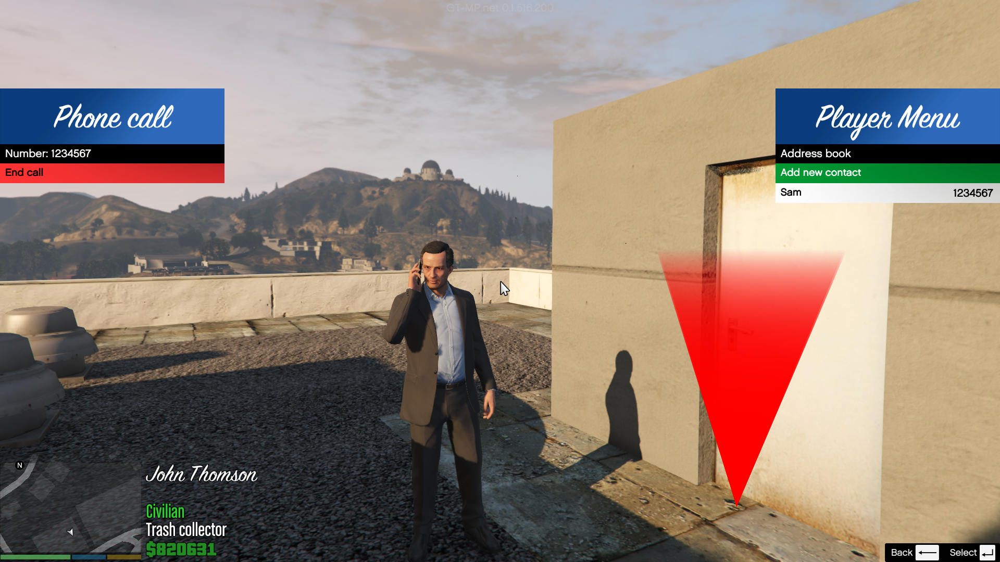

## FAQ

### This FAQ is work in progress, I try to write a more indepth one when I have the time.

### 1. I want to create a new job, what do I do?
Creating new jobs is easy, take a look at the jobs folder and see how the TrashJob.cs is done and the InitJobs method in the JobManager.cs.

### 2. I want to create a new faction, what do I do?
Take a look in the factions folder and see how the other factions are created and added in the FactionManager.cs constructor method.

### 3. I want to add houses, what do I do?
Look in the database and find the tables related to houses like house_template and house_teleports.

